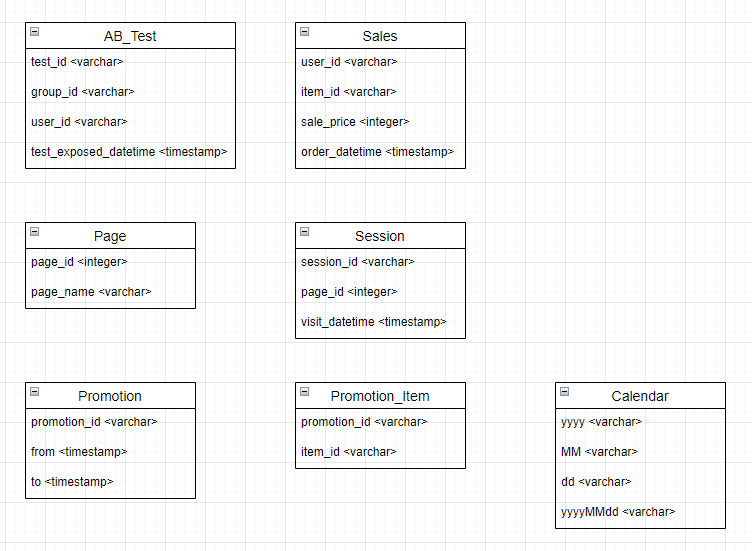

Q1) AB Test : GMV per Customer (related tables : `AB_Test`, `Sales`)  

Please calculate each AB Test group's average of GMV per Customer.  

1. `user_id` is unique for each ab-test. 
2. Each customers' GMV should be calculated *after* test exposure case only.  
3. There are customers *who buy nothing.* Let their GMV as 0.      

---

Q2) Funnel Key (related tables : `Page`, `Session`)  

Please make a `funnel_id` <integer> column with below conditions :  

1. `Session` table is historical user action log table.  
2. `Page` table is meta table for page information which have unique `page_id` & `page_name`.  
2. If customer visit `page_name` = 'Thankyou' then funnel is over.  
3. Funnel is partition of session : If session is over then funnel also over.   
4. For each `session_id`, `funnel_id` starts with index 1, 2, 3 ...  

---

Q3) Daily Promotion Item Count (related tables : `Promotion`, `Promotion_Item`, `Calendar`)  

Please calculate daily promotion item count.  

1. Each promotion have start ~ end information at `Promotion` table.  
2. `Promotion` table's `promotion_id` is unique.  
3. For promotion <-> item mapping, you can refer `Promotion_Item`. 
4. Items cannot be allocated to multiple promotions for same day. 
5. `Calendar` table has every single days as a row.  
6. Each columns of `Calendar` have date format strings as their value.  
